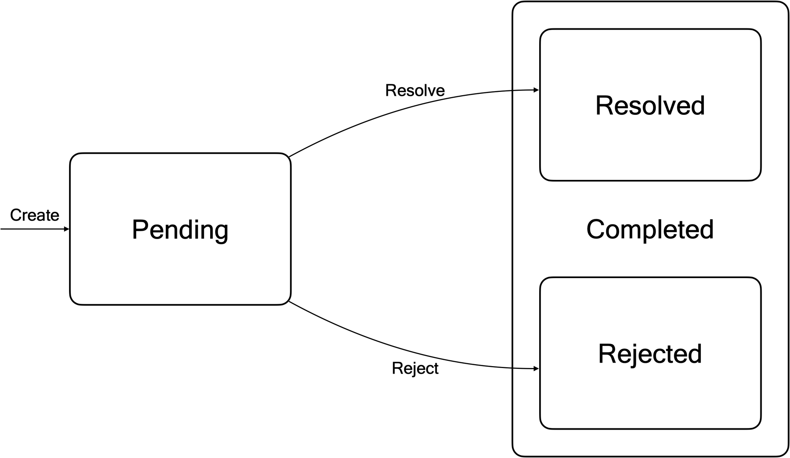
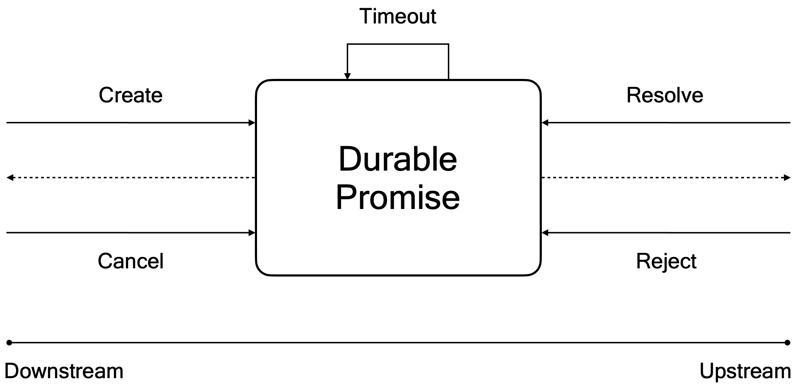

# Durable Promises

**Keywords**

*Promise, Future, Awaitable, Future Value, Write Once Register, Write Only Register, Single Assignment Container, Concurrency, Coordination*

A **promise**, also called a future or an awaitable, is a representation of a future value. A promise is either pending or completed, that is, resolved or rejected.



## Application Programming Interface (API)

A promise is a coordination primitive: In a typical scenario, a downstream execution creates a promise and awaits its completion. An upstream execution completes the promise, either resolving the promise, signaling success, or rejecting the promise, signaling failure. 

Logically, the Application Programming Interface (API) is divided in two parts, the Downstream API and the Upstream API.



## Downstream API

- **Create**

  A downstream component may create a promise

  ```
  Create(promise-id, idempotence-key, param, timeout)
  ```

- **Cancel**

  A downstream component can cancel an existing promise

  ```
  Cancel(promise-id, idempotence-key, value)
  ```

## Upstream API

- **Resolve**

  An upstream component can resolve an existing promise, signaling success

  ```
  Resolve(promise-id, idempotence-key, value)
  ```


- **Reject**
  An upstream component can reject a promise, signalling failure

  ```
  Reject(promise-id, idempotence-key, value)
  ```

# Idempotence

TBD